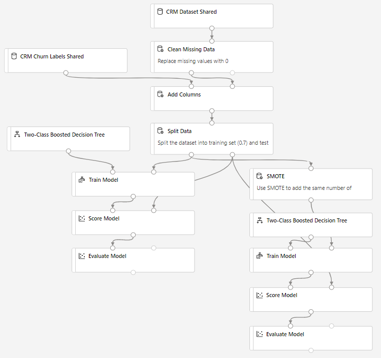

# Use boosted decision tree to predict churn with Azure Machine Learning designer

**Designer sample 5**

Learn how to build a complex machine learning pipeline without writing a single line of code using the designer.

This pipeline trains 2 **two-class boosted decision tree** classifiers to predict common tasks for customer relationship management (CRM) systems - customer churn. The data values and labels are split across multiple data sources and scrambled to anonymize customer information, however, we can still use the designer to combine data sets and train a model using the obscured values.

Because you're trying to answer the question "Which one?" this is called a classification problem, but you can apply the same logic shown in this sample to tackle any type of machine learning problem whether it be regression, classification, clustering, and so on.

Here's the completed graph for this pipeline:

## Data

The data for this pipeline is from KDD Cup 2009. It has 50,000 rows and 230 feature columns. The task is to predict churn, appetency, and up-selling for customers who use these features. For more information about the data and the task, see the [KDD website](https://www.kdd.org/kdd-cup/view/kdd-cup-2009).

## Pipeline summary

This sample pipeline in the designer shows binary classifier prediction of churn, appetency, and up-selling, a common task for customer relationship management (CRM).

First, some simple data processing.

- The raw dataset has many missing values. Use the **Clean Missing Data** module to replace the missing values with 0.

    

- The features and the corresponding churn are in different datasets. Use the **Add Columns** module to append the label columns to the feature columns. The first column, **Col1**, is the label column. From the visualization result we can see the dataset is unbalanced. There way more negative (-1) examples than positive examples (+1). We will use **SMOTE** module to increase underrepresented cases later.

    

- Use the **Split Data** module to split the dataset into train and test sets.

- Then use the Boosted Decision Tree binary classifier with the default parameters to build the prediction models. Build one model per task, that is, one model each to predict up-selling, appetency, and churn.

- In the right part of the pipeline, we use **SMOTE** module to increase the percentage of positive examples. The SMOTE percentage is set to 100 to double the positive examples. Learn more on how SMOTE module works with [SMOTE module reference0](algorithm-module-reference/smote.md).

## Results

Visualize the output of the **Evaluate Model** module to see the performance of the model on the test set. 

 You can move the **Threshold** slider and see the metrics change for the binary classification task. 

## Next steps

Explore the other samples available for the designer:

- [Sample 1 - Regression: Predict an automobile's price](regression-automobile-price-prediction-basic.md)
- [Sample 2 - Regression: Compare algorithms for automobile price prediction](regression-automobile-price-prediction-compare-algorithms.md)
- [Sample 3 - Classification with feature selection: Income Prediction](binary-classification-feature-selection-income-prediction.md)
- [Sample 4 - Classification: Predict credit risk (cost sensitive)](binary-classification-python-credit-prediction.md)
- [Sample 6 - Classification: Predict flight delays](r-script-flight-delay-prediction.md)
- [Sample 7 - Text Classification: Wikipedia SP 500 Dataset](text-classification-wiki.md)
